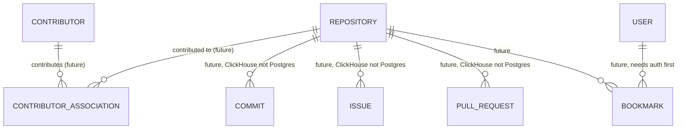

# Entity-Relationship Model

**Checkpoint:** 0.2 (companion to `DATABASE_DESIGN.md`)
**Status:** Frozen — updated to reflect `DATABASE_ARCHITECT_REVIEW.md` findings; see `DATABASE_DESIGN_CHANGELOG.md`.
**Scope:** Visual/structural representation of the conceptual model — attributes at domain level, not SQL types

---

## 1. ER Diagram (Core V1 Entities)

```mermaid
erDiagram
    OWNER ||--o{ REPOSITORY : owns
    LICENSE ||--o{ REPOSITORY : "licensed under"
    REPOSITORY ||--o{ REPOSITORY_TOPIC : tagged
    TOPIC ||--o{ REPOSITORY_TOPIC : "applied to"
    REPOSITORY ||--o{ REPOSITORY_TECHNOLOGY : uses
    TECHNOLOGY ||--o{ REPOSITORY_TECHNOLOGY : "used by"
    REPOSITORY ||--o{ REPOSITORY_DEPENDENCY : depends_on
    REPOSITORY ||--o{ REPOSITORY_METRICS : "measured by (time series)"
    REPOSITORY ||--o{ REPOSITORY_SNAPSHOT : "observed at (time series)"
    REPOSITORY ||--o{ REPOSITORY_SCORE : "scored as (time series)"
    REPOSITORY ||--o{ REPOSITORY_EMBEDDING : "embedded as"
    REPOSITORY ||--o{ REPOSITORY_SIMILARITY : "similar to (self-ref, top-K)"

    OWNER {
        uuid id PK
        bigint github_id UK
        string login
        enum account_type "User or Organization"
    }

    LICENSE {
        uuid id PK
        string spdx_id UK
        string name
        bool is_osi_approved
    }

    REPOSITORY {
        uuid id PK
        bigint github_id UK
        uuid owner_id FK
        string full_name UK
        string primary_language
        uuid license_id FK "nullable"
        bool is_archived
        bool is_fork
        bool is_accessible "default true, added in review revision"
        timestamptz inaccessible_since "nullable, added in review revision"
        enum last_extraction_status "pending/success/failed"
        timestamptz github_created_at
        timestamptz pushed_at
        timestamptz fetched_at
    }

    TOPIC {
        uuid id PK
        string slug UK
        string name
    }

    REPOSITORY_TOPIC {
        uuid repository_id PK_FK
        uuid topic_id PK_FK
    }

    TECHNOLOGY {
        uuid id PK
        string slug UK
        string name
        enum category "language/framework/database/tool/platform"
    }

    REPOSITORY_TECHNOLOGY {
        uuid repository_id PK_FK
        uuid technology_id PK_FK
        enum role "primary/secondary/dev"
        enum detected_via "manifest/dockerfile/ci/linguist"
        numeric confidence
        timestamptz first_detected_at "preserved across recompute"
        timestamptz last_confirmed_at
        timestamptz removed_at "nullable, added in review revision"
    }

    REPOSITORY_DEPENDENCY {
        bigint id PK
        uuid repository_id FK
        string package_name
        enum ecosystem "npm/pypi/cargo/go/maven/nuget/rubygems"
        string resolved_version
        bool is_direct
        bool is_dev
        int dependency_age_days
        int vulnerability_count
    }

    REPOSITORY_METRICS {
        bigint id PK
        uuid repository_id FK
        date snapshot_date "declared partition key, RANGE"
        int commits_last_3mo
        int unique_contributors_last_12mo
        numeric top_contributor_commit_share
        int days_since_last_commit
        numeric issue_close_rate
        bool readme_present
        numeric readme_readability_score
        int loc_total
        jsonb extended_features
    }

    REPOSITORY_SNAPSHOT {
        bigint id PK
        uuid repository_id FK
        date snapshot_date "declared partition key, RANGE; weekly cadence"
        int stars_count
        int forks_count
        int watchers_count "documented as non-independent signal, see design doc"
        int open_issues_count
    }

    REPOSITORY_SCORE {
        bigint id PK
        uuid repository_id FK
        enum score_type "difficulty/quality/community_health"
        numeric score_value
        jsonb score_breakdown
        string algorithm_version
        timestamptz computed_at "declared partition key, RANGE"
    }

    REPOSITORY_EMBEDDING {
        uuid repository_id PK_FK
        string model_name PK
        vector_768 embedding "fixed at 768 dims for V1, single-model assumption"
        string source_text_hash
        timestamptz computed_at
    }

    REPOSITORY_SIMILARITY {
        uuid repository_id PK_FK
        uuid similar_repository_id PK_FK
        enum similarity_method PK "embedding/feature/hybrid"
        numeric similarity_score
        int rank
    }
```

---

## 2. Deferred Entities (Not in V1 — Shown for Extensibility Context Only)



These are **not implemented** in Checkpoint 0.2. Included here only to show that the core schema's foreign-key surface (`repository.id` as a stable UUID) is what future entities will hang off of — validating that today's design doesn't block tomorrow's additions.

---

## 3. Cardinality Detail & Rationale

### 3.1 Owner → Repository (1:N)

One GitHub account (person or org) owns zero-to-many repositories. A repository has exactly one owner at any point in time (ownership transfers are treated as an update to `repository.owner_id`, not a historical log — GitHub itself doesn't expose ownership history via public API, so this isn't a gap we can fill anyway).

### 3.2 License → Repository (1:0..N, optional)

A license can apply to many repositories; a repository has zero or one license. Modeled as a nullable FK, not a join table, because the relationship carries no attributes of its own (unlike Repository↔Technology).

### 3.3 Repository ↔ Topic (M:N)

Pure many-to-many, no edge attributes. GitHub topics carry no confidence/role — a repository either has a topic or it doesn't, as declared by the maintainer.

### 3.4 Repository ↔ Technology (M:N with edge attributes)

This is the schema's first **associative entity** — the join table itself carries meaningful data (role, confidence, detection method) that cannot be pushed onto either side. This is the textbook case for a table with its own attributes rather than a bare join.

**Revision (per `DATABASE_ARCHITECT_REVIEW.md` Finding 6):** the edge now also carries `removed_at`, a nullable timestamp set when a recomputation pass no longer detects a previously-confirmed association. The relationship remains current-state-shaped (one row per `repository_id, technology_id` pair, never duplicated), not a full history table — `removed_at` is a marker, not an append-only log, keeping the correctness fix additive rather than a structural change to the relationship's cardinality.

### 3.5 Repository → Repository Dependency (1:N)

One-directional, high cardinality (a repository can have hundreds of transitive dependencies). No join table needed — Dependency has no independent existence outside its owning repository (a `left-pad` dependency row in repo A is a distinct fact from a `left-pad` dependency row in repo B; we don't need a canonical `left-pad` entity for V1, unlike Technology which *is* deliberately canonical/deduplicated).

### 3.6 Repository → {Metrics, Snapshot, Score} (1:N, time-series)

All three follow the same shape: append-only history, one row per repository per observation point. None are updated in place. This is the pattern that gives the platform its trend-analysis capability (`REPOSITORY_INTELLIGENCE_ENGINE.md` §10) without a separate "history" shadow table for each — the *primary* table already is the history.

**Revision (per `DATABASE_ARCHITECT_REVIEW.md` Finding 9):** all three tables now have a **declared future partition key** (`snapshot_date` for Metrics and Snapshot, `computed_at` for Score) fixed in the logical schema, even though physical partitioning is not implemented in Checkpoint 0.2. This does not change the cardinality or relationship shape described above — it is a forward-looking storage decision, not a modeling change — but it is recorded here because the partition key must be chosen consistently with the time-series column already driving each table's uniqueness constraint (`repository_id, snapshot_date` / `computed_at`), and that consistency is a structural property of the relationship, not merely an implementation detail.

**Cadence revision (per `DATABASE_ARCHITECT_REVIEW.md` Finding 5):** Repository Snapshot's default observation cadence is fixed at weekly (matching Metrics), not the higher frequency originally speculated — reducing this table's growth rate without narrowing any supported query.

### 3.7 Repository → Embedding (1:N, scoped by model)

Composite key `(repository_id, model_name)` rather than a surrogate — there is no meaningful concept of "the embedding" independent of which model produced it, so the natural key is also the correct key.

**Revision (per `DATABASE_ARCHITECT_REVIEW.md` Finding 7):** the vector column's width is fixed at 768 dimensions for V1, with an explicit single-model assumption documented (`DATABASE_DESIGN.md` §2.11). The composite key still correctly anticipates multiple models being stored side by side in the future, but only if a future model shares this dimensionality — a genuinely different-dimensioned model requires a new table or column change, not solved speculatively now.

### 3.8 Repository ↔ Repository (M:N, self-referential, bounded)

The only self-referential relationship in the schema. Deliberately **not** a full similarity matrix (see `DATABASE_DESIGN.md` §2.12) — bounded to top-K per `(repository, method)`, keeping growth linear rather than quadratic in repository count.

---

## 4. Referential Integrity Rules

| Rule | Enforced By |
|---|---|
| A repository's `owner_id` must reference an existing owner | FK constraint, `ON DELETE RESTRICT` (owners are never deleted while owning repos) |
| A repository's `license_id` may be null; if present, must exist | FK constraint, `ON DELETE SET NULL` (losing license reference data shouldn't delete the repository) |
| Repository↔Technology and Repository↔Topic rows die with their repository | FK constraint, `ON DELETE CASCADE` on `repository_id` |
| Repository Metrics/Snapshot/Score/Embedding/Dependency rows die with their repository | FK constraint, `ON DELETE CASCADE` — history has no meaning once the repository record itself is purged (note: repositories are soft-deleted/archived in practice, per `DATABASE_DESIGN.md` §2.1, so hard cascade deletes are rare in production but correct as a constraint) |
| `repository_similarity.repository_id ≠ similar_repository_id` | CHECK constraint — a repository is never "similar to itself" as a stored fact |
| `(repository_id, technology_id)` unique per Repository↔Technology row | Composite PK — a repository cannot have two rows claiming the same technology (role changes update the existing row; `removed_at` marks absence in place, it does not delete the row) |
| A GitHub-side 404/403 on a previously-known repository is recorded, not deleted | `is_accessible = false`, `inaccessible_since` set — added per `DATABASE_ARCHITECT_REVIEW.md` Finding 4, closing the gap between `DATABASE_DESIGN.md` §2.1's stated lifecycle promise and the schema that previously had no column to fulfill it |

**Operational note on CASCADE (per `DATABASE_ARCHITECT_REVIEW.md` Finding 10):** the CASCADE constraints above are correct and unchanged, but at scale (hundreds of millions of child rows across the time-series tables) a hard `DELETE FROM repositories` is a heavy, lock-holding operation. With `is_accessible`/`inaccessible_since` now available, hard deletion of a repository row should be treated as a rare, administrative action — never a routine step in the acquisition or refresh pipelines, which should use the soft-delete columns instead.

---

## 5. What This Model Deliberately Does Not Decide Yet

Per the instruction to design before implementing: this document fixes *entities and relationships*, not:
- Exact PostgreSQL column types (int vs bigint, varchar length limits)
- Index strategy (deferred to `QUERY_DRIVEN_SCHEMA_DESIGN.md` Phase 3, which derives indexes from actual query patterns)
- The mechanics of physical partitioning (partition *keys* are now declared per §3.6 above; the `CREATE TABLE ... PARTITION BY` implementation itself remains deferred, per `MIGRATION_STRATEGY.md`)
- Migration ordering (deferred to `MIGRATION_STRATEGY.md`)

## 6. Revision Note

This document was updated to incorporate `DATABASE_ARCHITECT_REVIEW.md` Findings 4, 5, 6, 7, 9, and 10. No entity was added or removed, and no relationship's cardinality changed — every revision above is an attribute-level addition (lifecycle columns, a removal timestamp, a fixed vector width, declared partition keys) or a documentation clarification (CASCADE operational guidance, `watchers_count` signal independence). See `DATABASE_DESIGN_CHANGELOG.md` for the complete, consolidated change list across all four design documents.

Proceed to `QUERY_DRIVEN_SCHEMA_DESIGN.md` to stress-test this model against the platform's actual query workload.
